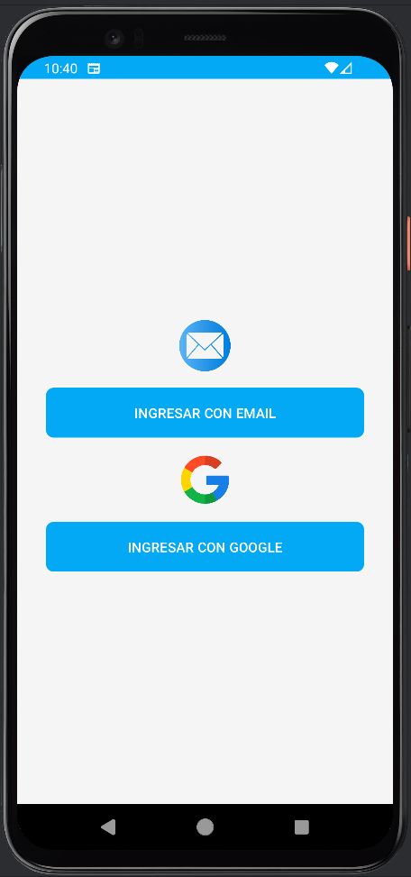
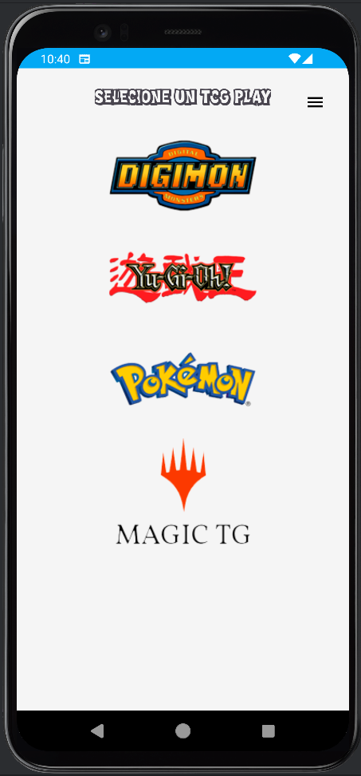
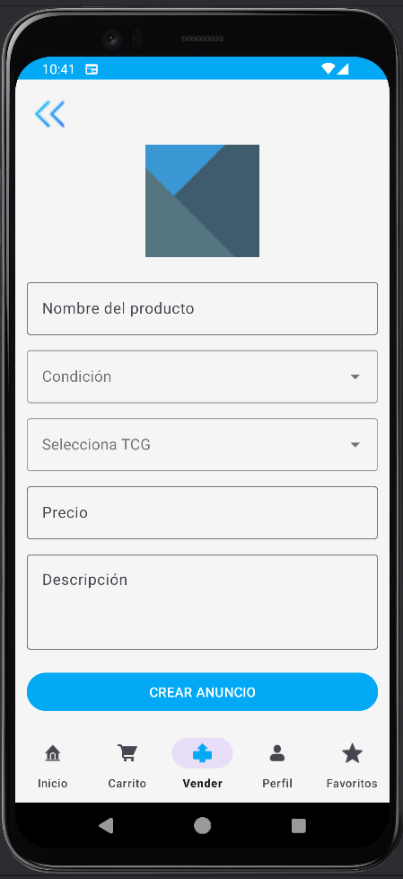
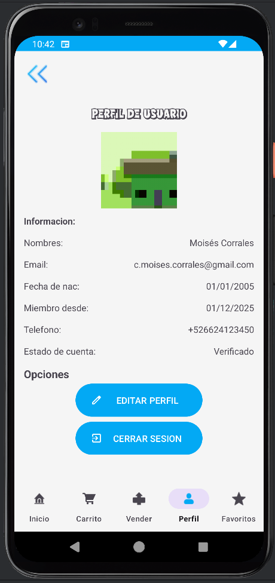
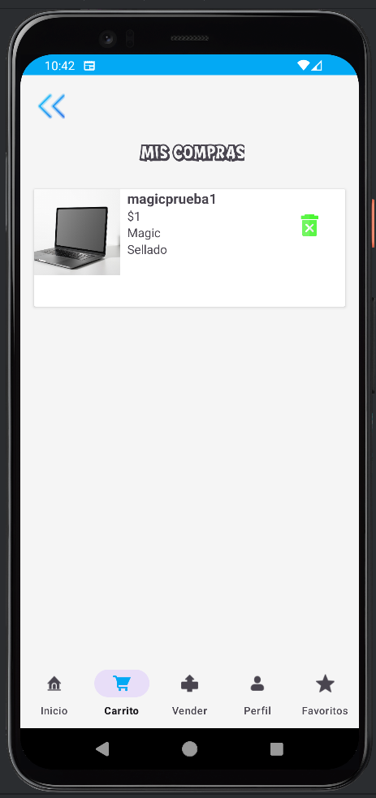

# Seras Cards Store 📱🃏

Aplicación móvil desarrollada en **Android con Kotlin**, conectada a **Firebase**, para la compra, venta y administración de cartas TCG como **Digimon, Yu-Gi-Oh, Pokémon y Magic**.

Incluye:
- Autenticación con **correo y Google**
- Publicación de productos con imágenes
- Favoritos y carrito
- Perfil de usuario editable
- Modificación y eliminación de publicaciones
- Almacenamiento en **Firebase Realtime Database y Firebase Storage**

---

## 🔐 Inicio de Sesión

Permite iniciar sesión con:
- Correo electrónico y contraseña
- Cuenta de Google

---

## 🏠 Menú Principal TCG

Desde este menú puedes ingresar a cualquier categoría:
- Digimon
- Yu-Gi-Oh
- Pokémon
- Magic

---

## 📋 Publicaciones por Categoría

Muestra todas las publicaciones según el TCG seleccionado.
Desde aquí se pueden:
- Ver detalles
- Agregar a favoritos
- Agregar al carrito
- Seleccionar para modificar o eliminar

---

## ➕ Crear Nueva Publicación

Permite crear una nueva publicación:
- Nombre del producto
- Precio
- Condición
- Descripción
- Selección del TCG
- Hasta **3 imágenes**
- Se guarda automáticamente en su nodo correspondiente en Firebase

---

## 👤 Perfil del Usuario

Muestra la información del usuario:
- Nombre
- Correo
- Imagen de perfil

Incluye opciones para:
- Editar datos
- Cambiar foto de perfil

---

## ⭐ Favoritos

Muestra todas las publicaciones guardadas como favoritas.
Se pueden eliminar individualmente.

---

## 🛒 Carrito de Compras

Muestra las publicaciones agregadas al carrito.
Se pueden eliminar cuando el usuario desee.

---

## 🛠 Tecnologías Utilizadas

- Kotlin
- Android Studio
- Firebase Authentication
- Firebase Realtime Database
- Firebase Storage
- RecyclerView
- Glide
- ViewBinding

---

## 📌 Autor
Valdez Santana
Proyecto desarrollado como parte de un sistema de tienda de cartas TCG para administración, Seras Cards Store desde aplicación móvil.

---

## ✅ Estado del Proyecto

✔ Login con Firebase  
✔ Publicaciones dinámicas  
✔ Favoritos  
✔ Carrito  
✔ Perfil editable  
✔ Subida de imágenes  
✔ Modificación de publicaciones  
✔ Eliminación de publicaciones

---

